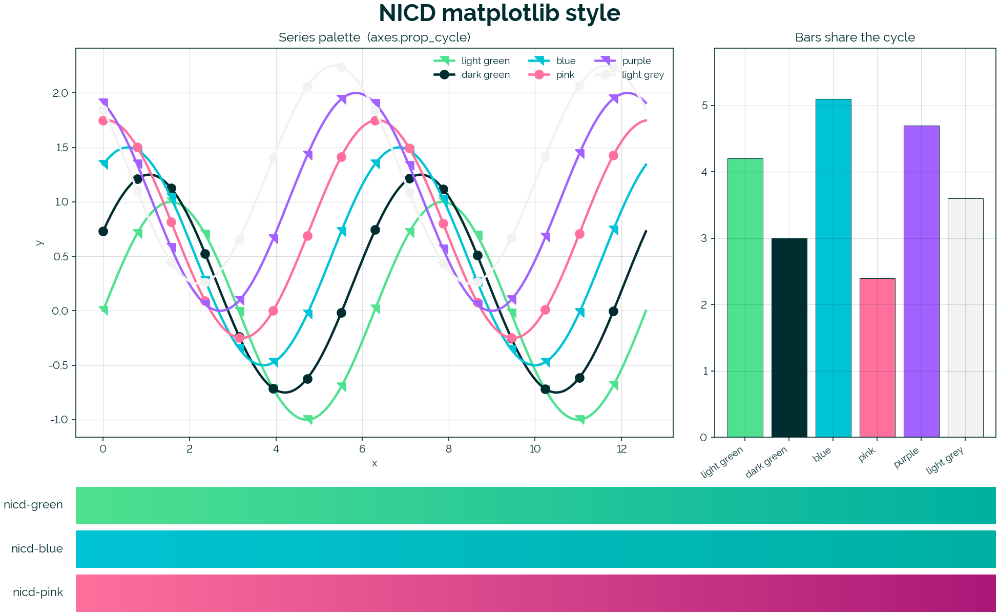

# matplotlib-nicd

A matplotlib style sheet, named colour palette, and gradient colormaps in the
NICD brand.



## Contents

| File | What it provides |
|---|---|
| `nicd.mplstyle` | The style: series colour cycle, font (Derailed), grid/text colours, ASCII minus sign. |
| `nicd_palette.py` | Registers the six named colours and three gradient colormaps at import time; exposes `use()` to apply the style plus the marker cycle. |
| `demo.py` | Reproduces the image above. |

### Named colours (`nicd:` namespace)

| Name | Hex |
|---|---|
| `nicd:light-green` | `#4fe18f` |
| `nicd:dark-green`  | `#002d30` |
| `nicd:blue`        | `#00c3d6` |
| `nicd:pink`        | `#ff709d` |
| `nicd:purple`      | `#a361ff` |
| `nicd:light-grey`  | `#f2f2f2` |

### Gradient colormaps

| Name | From → To |
|---|---|
| `nicd-green` | `#4fe18f` → `#00b0a2` |
| `nicd-blue`  | `#00c3d6` → `#00b0a2` |
| `nicd-pink`  | `#ff709d` → `#aa1878` |

Each is also registered in its reversed `_r` form.

### Marker cycle

`nicd_palette.use()` pairs the colour cycle with a marker cycle:
`RIGHT_TRIANGLE` (right angle at top-right) for odd-indexed series, `o`
(circle) for even-indexed series, repeating to match the six-colour
cycle. The triangle lives at `nicd_palette.RIGHT_TRIANGLE` if you want
to address it directly.

## Install

```bash
git clone https://github.com/jstutternicd/matplotlib-nicd.git ~/Projects/matplotlib-nicd

# Make the style discoverable by name.
mkdir -p ~/.matplotlib/stylelib
ln -sf ~/Projects/matplotlib-nicd/nicd.mplstyle ~/.matplotlib/stylelib/nicd.mplstyle

# Make the palette importable.
ln -sf ~/Projects/matplotlib-nicd/nicd_palette.py ~/.matplotlib/nicd_palette.py
```

The repo dir can live anywhere — only the two symlinks need to land in
`~/.matplotlib/`.

### Font

The style asks for **Derailed** as the sans-serif. If you don't have it
installed, matplotlib falls back to Helvetica → Arial → DejaVu Sans (in that
order) and prints a warning the first time. Install Derailed into
`~/Library/Fonts` (macOS), then delete `~/.matplotlib/fontlist-*.json` so
matplotlib rebuilds its font cache on next import.

## Usage

```python
import sys, pathlib
sys.path.insert(0, str(pathlib.Path.home() / ".matplotlib"))
import nicd_palette        # registers names + colormaps
import matplotlib.pyplot as plt

nicd_palette.use()         # style + colour cycle + marker cycle

# Series colours and markers come from the cycle automatically.
ax.plot(x, a, label="A")   # light-green + right triangle
ax.plot(x, b, label="B")   # dark-green + circle

# Or address one by name.
ax.fill_between(x, 0, y, color="nicd:light-green")

# Gradients for heatmaps / scatter / imshow.
ax.imshow(grid, cmap="nicd-green")
ax.scatter(x, y, c=z, cmap="nicd-pink_r")
```

If you only want the colours (no markers), use `plt.style.use("nicd")`
directly — the marker half is only added by `nicd_palette.use()` because
`Path`-based markers can't be expressed in an mplstyle file.

`nicd_palette` must be imported **before** any draw call, because the style's
`axes.prop_cycle` references the named colours rather than hex literals.

## Reproducing the demo

From the cloned repo root:

```bash
python demo.py
```

(or `uv run --with matplotlib python demo.py` for an isolated env)
